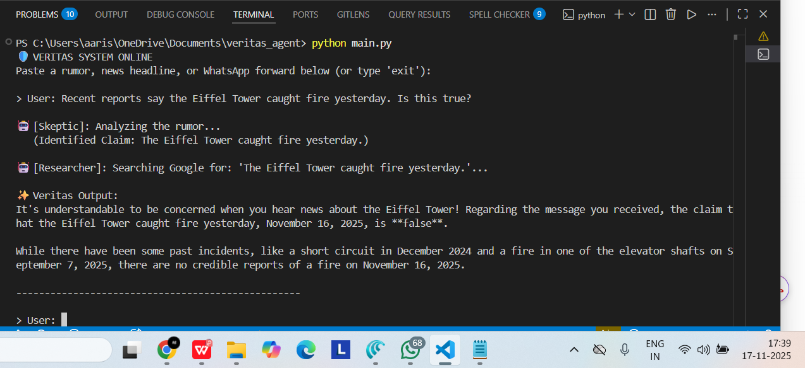

# Veritas: The Viral Misinformation Shield 🛡️


## 1. Problem Statement

In the age of social media, misinformation spreads faster than truth. Well-meaning people often forward "viral rumors" (e.g., health scams, false disaster alerts) because verifying facts is time-consuming and correcting friends can feel confrontational.

## 2. The Solution

**Veritas** is a sequential multi-agent system designed to "compassionately debunk" rumors. Instead of simply stating facts, it uses a three-stage agent pipeline to understand the claim, verify it against live Google Search data, and generate a polite, non-judgmental correction that users can copy and paste to their family groups.

## 3. Architecture

The system utilizes a **Sequential Multi-Agent Pattern** built with Python and the Google Gen AI SDK.

1.  **Input:** User pastes a suspicious text.
2.  **Agent A (The Skeptic):** Uses `gemini-2.0-flash` to parse the text and extract the core factual claim, ignoring emotional noise.
3.  **Agent B (The Researcher):** Equipped with the **Google Search Tool (Grounding)**. It takes the claim and queries live internet data to find the latest evidence.
4.  **Agent C (The Empath):** Synthesizes the raw evidence into a kind, human-readable response.
5.  **Session Manager:** Maintains the state of the conversation and history.

## 4. Key Features (Course Concepts)

- **Multi-Agent System:** Sequential chain of specialized agents (Skeptic -> Researcher -> Empath).
- **Tools:** Uses **Google Search Grounding** to access real-time information (not limited to training data).
- **Sessions & Memory:** The `VeritasSession` class manages the application state and history.

## 5. How to Run

1.  Clone this repository.
2.  Install dependencies:
    ```bash
    pip install google-genai
    ```
3.  Open `main.py` and paste your Google AI Studio API Key.
4.  Run the agent:
    ```bash
    python main.py
    ```

## 6. Example Usage & Live Demo

### Scenario:

A user asks about a viral rumor regarding the Eiffel Tower.

**1. User Input:**

> "Recent reports say the Eiffel Tower caught fire yesterday. Is this true?"

**2. Agent Execution (Proof):**
The system identifies the claim, searches Google for real-time verification, and finds that the reports are false (based on a recent AI image hoax).


_Figure 1: Terminal output showing Veritas successfully connecting to Google Search to debunk a rumor._

**3. Final Veritas Output:**

> "It's understandable to be concerned when you hear news about the Eiffel Tower! Regarding the message you received, the claim that the Eiffel Tower caught fire yesterday is **false**. While there have been some past incidents, there are no credible reports of a fire yesterday."
